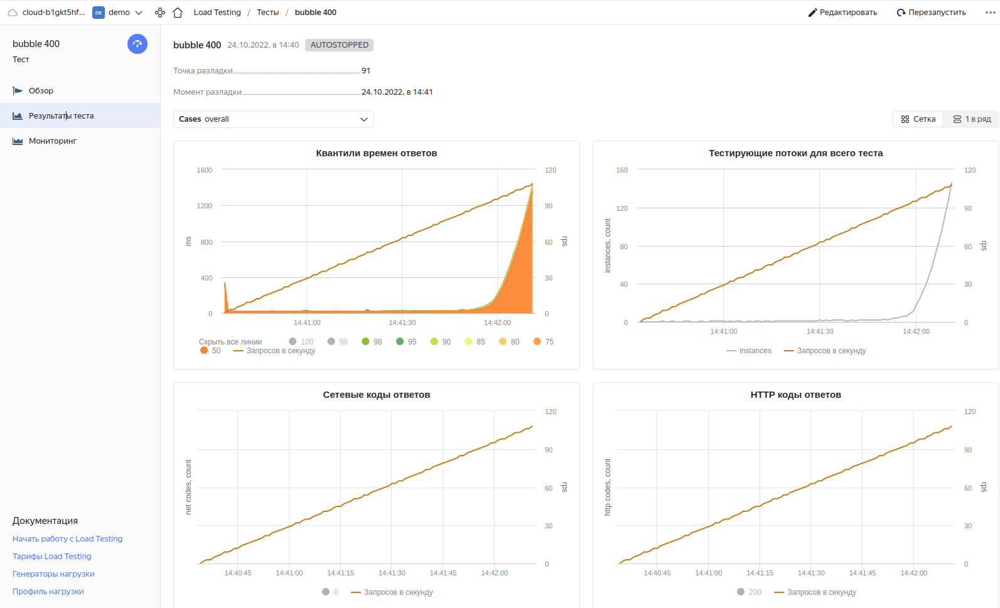
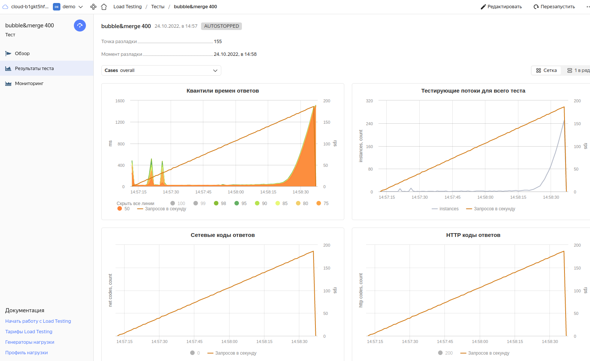
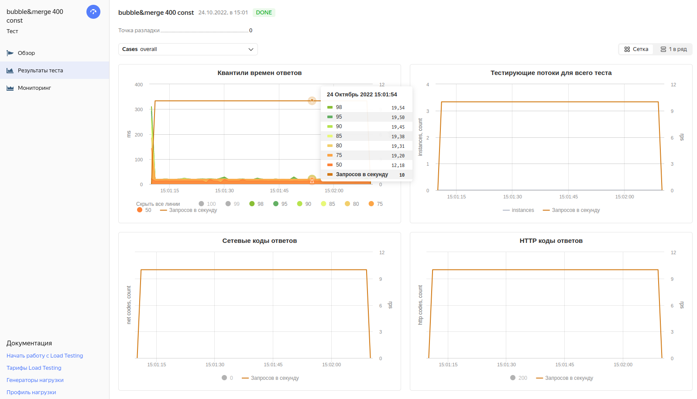

# Инструкция по созданию тестового стенда с агентом и тестируемым сервисом
Видео-инструкция о том, как создавать каталог в Яндекс.Облаке и развернуть внем агента и тестовый сервис в файле ``Homework-instruction.mp4``
1.	Создадим пару ssh-ключей: https://cloud.yandex.ru/docs/compute/operations/vm-connect/ssh#creating-ssh-keys , публичной часть которого будем использовать при создании агнета и тестового приложения
2. Инструкция как создать агента: https://cloud.yandex.ru/docs/load-testing/quickstart

* Дополнения к инструкции:
  * При создании сервисного аккаунта дополнительно к роли ``loadtesting.generatorClient`` добавьте также роли ``vpc.user`` и ``compute.admin``
  * Параметры создаваемого агента:
    * Имя: test-agent
    * Зона доступности: ru-central1-a
    * Агент: Small
    * Подсеть: default , созданная по умолчанию при создании каталога
    * Сервисный аккаунт и группа безопасности: создаем, следуя инструкции (в видео инструкции есть детальный рассказ)
    * Логин: имя тестового пользователя (пусть будет ``test``)
    * SSH-ключ: содержимое публичного ключа (<имя_ключа>.pub), который создали в самом начале, в п.1
    * Нажимаем кнопку «Создать» в нижней части интерфейса
    * Ждем пока статус Агента станет READY_FOR_TEST

2. Инструкция как поднять тестируемое приложение
Тестовое приложение:
  * Разворачивается из docker-контейнера https://hub.docker.com/repository/docker/shbr2022/sorting
  * Запускается и работает на ``80`` порту
  * Для того, чтобы развернуть приложение:
    * Открываем сервис Compute Cloud в том же каталоге, в котором создали агента.
    * Выбираем в правом верхнем углу «Создать ВМ»
    * В открывшемся интерфейсе создания ВМ заполняем поля:
      * имя: demo-sorting
      * Зона доступности: ru-central1-a
      * В разделе «Выбор образа/загрузочного диска» нажимаем «Настроить» и заполняем:
        * Имя: sorting
        * Docker-образ: shbr2022/sorting
      * Платформа: Intel Ice Lake
      * vCPU: 2
      * Гарантированная доля vCPU: 100%
      * RAM: 2Гб
      * Подсеть: default (по умолчанию, которая создана при создании каталога)
      * Публичный адрес: Без адреса
      * Внутренний IPv4-адрес: Автоматически
      * Группы безопасности: указываем ту же, что и у агента
      * Сервисный аккаунт: Не выбрано (пусто)
      * Логин: имя тестового пользователя (пусть будет test)
      * SSH-ключ: содержимое публичного ключа (<имя_ключа>.pub), который создали в самом начале, в п.1
      * Нажимаем «Создать ВМ»
      * После этого открывается интерфейс Compute Cloud со списком Витуальных машин, в котором должна появится наша создаваемая машина. 
      * Ждем пока её статус станет Active.

# Задание
Провести тестирование производительности и определить:
1. максимальную производительность приложения для каждого типа запросов из вашего варианта
2. максимальную производительность для смеси запросов 1 и 2 типа, из вашего варианта, в пропорции 50/50
3. квантили времен ответов (q50, q80, q95) при нагрузке на сервис = 10 rps смесью запросов из п.2
## Тестовые данные:
У каждого студента своя комбинация тестовых данных(типов запросов). Свой вариант нужно посмотреть в variants.md. Тестовые данные лежат в test-data.

## Результаты:
  * п.1 и п.2 – число rps и ссылка на тест либо скриншот
  * п.3 – число миллисекунд для квантилей и ссылка на тест или скриншот

## Пример ответов по домашке:
1.	Результаты тестов:
    * 1 тип запроса: 91 rps - https://console.cloud.yandex.ru/folders/b1gs0jhu62lctl3qurjh/load-testing/tests/ff64vqv9h5x1ejmc48ck/overview 
      

        
Пример отчета

          
      </datails>
    * 2 тип запроса - 537 rps - https://console.cloud.yandex.ru/folders/b1gs0jhu62lctl3qurjh/load-testing/tests/ff6c48tft0fe2rz30n70/overview
      

        
Пример отчета

          
      </datails>
2.	Тест смесью 1 и 2 типа запросов: 155 rps - https://console.cloud.yandex.ru/folders/b1gs0jhu62lctl3qurjh/load-testing/tests/ff6dwf3y7p9cx4vam1kr/overview
      

        
Пример отчета

          
      </datails>
3.	Квантили теста с постоянной нагрузкой 10 rps: q50=12мс, q80=19мс, q95=19мс - https://console.cloud.yandex.ru/folders/b1gs0jhu62lctl3qurjh/load-testing/tests/ff6e7rcxkwcn4npbbpxm/report
      

        
Пример отчета

          
      </datails>
## Проверка результатов домашки:
В интерфейсе вашего облака нужно выдать пользователю ``ligreen@yandex.ru`` роль ``viewer`` на все обалко (не отдельно на каталог). При этом так же должна быть еще роль ``resource-manager.clouds.member``, которая выдается по умолчанию. Инструкция по добавлению пользователя: https://cloud.yandex.ru/docs/iam/quickstart#add-user
Если, при добавлении пользователя, возникла ошибка, то попробуйте добавить второй аккаунт ``ligreen1@yandex.ru``.

# Полезные ссылки:
1. Документация Yandex Cloud: https://cloud.yandex.ru/docs
1. Документация по сервису Yandex Load Testing: https://cloud.yandex.ru/docs/load-testing/
2. Документация по Yandex Tank: https://yandextank.readthedocs.io/en/latest/
3. Github yandex-tank: https://github.com/yandex/yandex-tank
